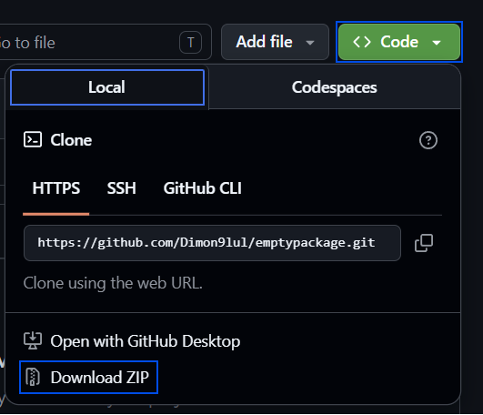
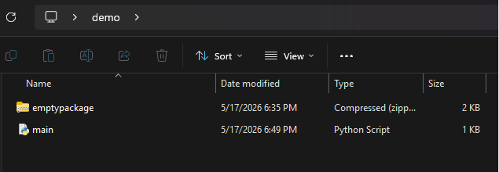

# Manual Package Installation in Python

This repository features an **empty** python package which is complete, but minimal to demonstrate how python packages are structured.
<br>
You may use this to study typical package structure and the discovery of packages. The modules have been filled with
basic functions and classes so you can practice using python packages and other tools like [inspect](https://docs.python.org/3/library/inspect.html) on this package.

## Table of Contents
- [Package Structure](#package-structure)
- [Manual Package Installation](#manual-package-installation)
  - [1. Download the Package](#1-download-the-package)
  - [2. Move the ZIP to the Directory](#2-move-the-zip-to-the-directory-you-need)
  - [3. Importing the Package](#3-importing-the-package)
  - [4. Alternative Method](#4-additionally)

## Package Structure
The structure of the package can be seen here:
```
.emptypackage
|—__init__.py
|—functional
| |—__init__.py
| |—input_classes.py
| |—input_functions.py
|—base.py
|—README.md
```

## Manual Package Installation
A simple method of installing packages in Python without the use of pip or other package managers is by appending the package directory to the `sys.path` list. 
That method can be used to avoid using pip or testing/developing packages, which aren't available on PyPi.
<br>
<span style="color:red;font-weight:bold">IMPORTANT:</span> If you use this method to install a python package, you will still have to resolve 
the dependencies of the package via package manager or manual installation. This method is best for simple packages, packages in development or learning 
how python works.
<br>
The tutorial to this method starts here:

### 1. Download the Package
The package can be downloaded as a folder or a .zip file. Services like GitHub have this feature implemented, so you can easily
access whole packages in the optimal format through the press of one button.



After pressing the green <span style="color:rgb(0,255,0)">Code</span> button, you can press the **Download ZIP** button to get a .zip file of the package.
<br>
<span style="color:red;font-weight:bold">CAUTION:</span> To get the package from this particular repository, you should download
the .zip file which is manually included in this repository. The zip can be acquired [here](emptypackage.zip).

### 2. Move the ZIP to the Directory You Need
The .zip file has to be located somewhere, where your `main.py` will be able to access it via filepath. You are
allowed to choose between relative and absolute filepath.
<br>
In this tutorial, a **relative** filepath is used with the ZIP file located in the same directory as the `main.py`.



### 3. Importing the Package
To import the package you have to first import the `sys` module, which is a standard python module.
After that, you need to add the directory of the .zip/folder to `sys.path` which behaves identically to a regular python `list`.
<br>
The package will now become accessible to your python application and can be interacted with as a regular python package.

```python
import sys

sys.path.append("emptypackage.zip")  # Here you have to use your own path.

from emptypackage import base
from emptypackage.functional import input_functions, input_classes

print(base.func0())
print(base.func1())

new_object = input_classes.FunctionalClass("value")
print(new_object.value)

print(input_functions.infunc(55))
```
Out:
```
1
2
value
5555
```
Congratulations! You have manually installed a python package!

### 4. Additionally
You may skip appending to `sys.path`, by **extracting** the directory from the .zip file. This comes with two advantages:
- Slightly simpler code
- Most IDEs will no longer display false errors, because they will automatically interact with the package.

The disadvantage being:
- This will only work if the package is located in the working directory of the python app and can be accessed via `import` directly.

Example:
```python
from emptypackage import base
from emptypackage.functional import input_functions, input_classes

print(base.func0())
print(base.func1())

new_object = input_classes.FunctionalClass("value")
print(new_object.value)

print(input_functions.infunc(55))
```
The code is simpler, but the package must be in the same directory as `main.py`.